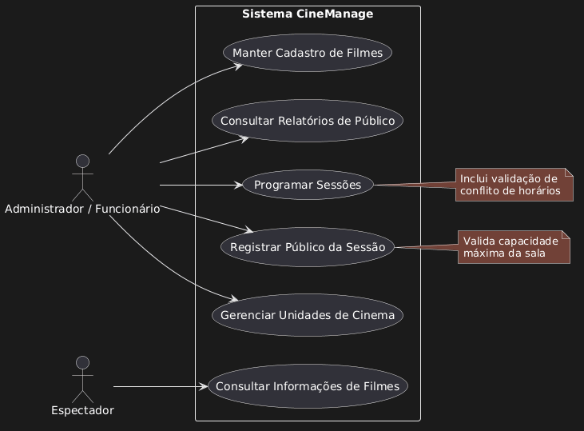

# 📊 Diagrama de Casos de Uso

Este diagrama descreve as interações entre os usuários (atores) e as funcionalidades principais do sistema de gestão da Rede de Cinemas.

---

## 🖼️ Visualização do Diagrama

---

## 👥 Atores e Escopo

### 1. Administrador / Funcionário
Ator responsável pela manutenção dos dados e gestão operacional.
*   **Ações:** Cadastrar filmes, gerenciar cinemas, programar sessões, registrar o público diário e consultar relatórios gerenciais.

### 2. Espectador
Ator que interage com o sistema para consumo de informação.
*   **Ações:** Consultar detalhes sobre os filmes (elenco, gêneros, diretores).

---

## 📝 Notas de Implementação
*   **Validação de Sessões:** O sistema deve impedir a sobreposição de horários na mesma unidade de cinema.
*   **Controle de Lotação:** O registro de público deve respeitar a capacidade máxima definida no cadastro do cinema.
