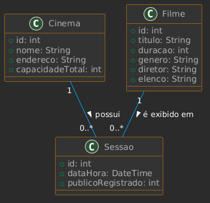

# 🏗️ Diagrama de Classes de Domínio

Este diagrama representa a estrutura de dados do sistema, focando nas entidades principais e como elas se relacionam para atender aos requisitos de negócio.

---

## 🖼️ Visualização

---

## 🧩 Descrição das Entidades

*   **Cinema:** Armazena os dados físicos de cada unidade, incluindo a `capacidadeTotal` para controle de lotação.
*   **Filme:** Contém as informações do catálogo (título, duração e metadados para consulta).
*   **Sessao:** É a entidade central. Ela conecta um **Filme** a um **Cinema** em um horário específico, registrando também o público para fins de relatório.

---

## 🔗 Relacionamentos
1.  **Cinema - Sessão (1:N):** Uma unidade de cinema pode sediar várias sessões ao longo do dia.
2.  **Filme - Sessão (1:N):** O mesmo filme pode estar em cartaz em múltiplas sessões e unidades diferentes.
