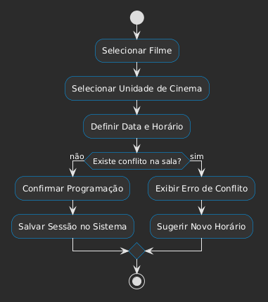
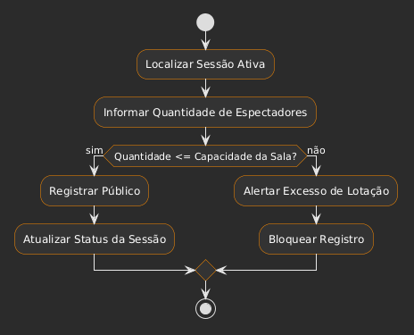

# 🏃 Diagramas de Atividade

Os diagramas de atividade abaixo ilustram o fluxo lógico dos principais processos de negócio do sistema CineManage.

---

## 📅 1. Programar Sessão
Este processo descreve a criação de uma nova exibição de filme em uma unidade específica.

## 🎟️ 2. Registrar Público
Este processo descreve a coleta de dados de ocupação após ou durante a realização de uma sessão.

---

## 📌 Observações de Negócio
- **Linearidade:** Os fluxos foram desenhados para serem executados de forma sequencial pelo funcionário.
- **Validações:** As decisões (losangos) representam pontos onde o sistema aplica as **Regras de Negócio (RN01 e RN02)** antes de persistir os dados no SQLite.
