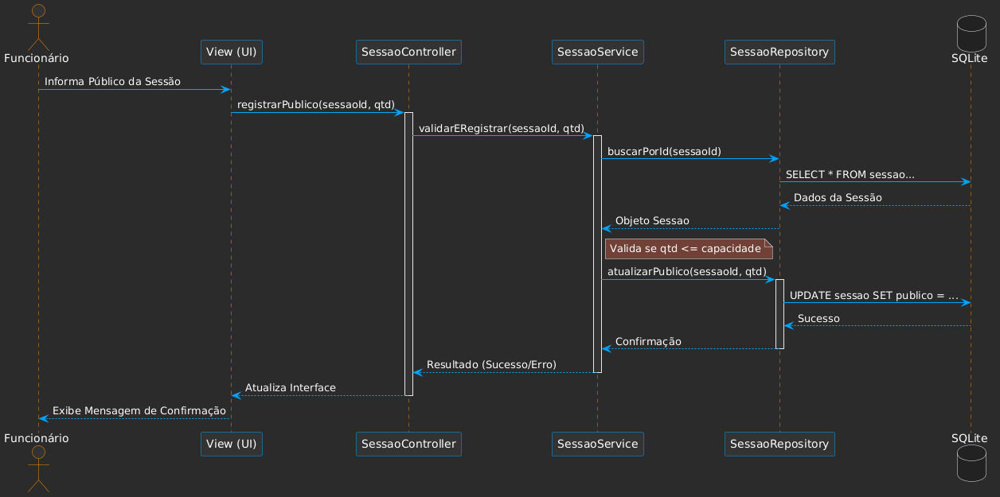

# 🔄 Diagramas de Sequência

O diagrama de sequência ilustra a interação entre as camadas do sistema para realizar a persistência de dados no SQLite, seguindo os padrões de projeto propostos.

---

## 🎟️ Caso de Uso: Registrar Público

Este fluxo demonstra a separação de responsabilidades: a **View** coleta os dados, o **Service** aplica as regras de negócio e o **Repository** executa o SQL.

---

## 🛠️ Papel de cada Camada

1.  **View:** Interface que recebe a interação do funcionário. Não possui lógica, apenas repassa os dados para o Controller.
2.  **Controller:** Orquestrador. Ele recebe a requisição da View e chama o serviço apropriado.
3.  **Service:** Onde a "mágica" acontece. Aqui é verificado se a quantidade de público não excede a capacidade do cinema antes de autorizar a gravação.
4.  **Repository:** Única camada que conhece o SQL. Ela abstrai a complexidade do banco de dados.
5.  **SQLite:** Camada de persistência física dos dados.
